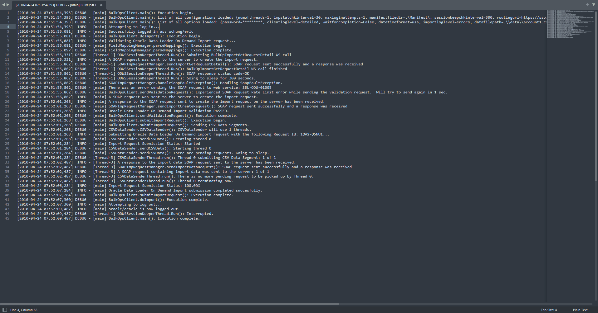
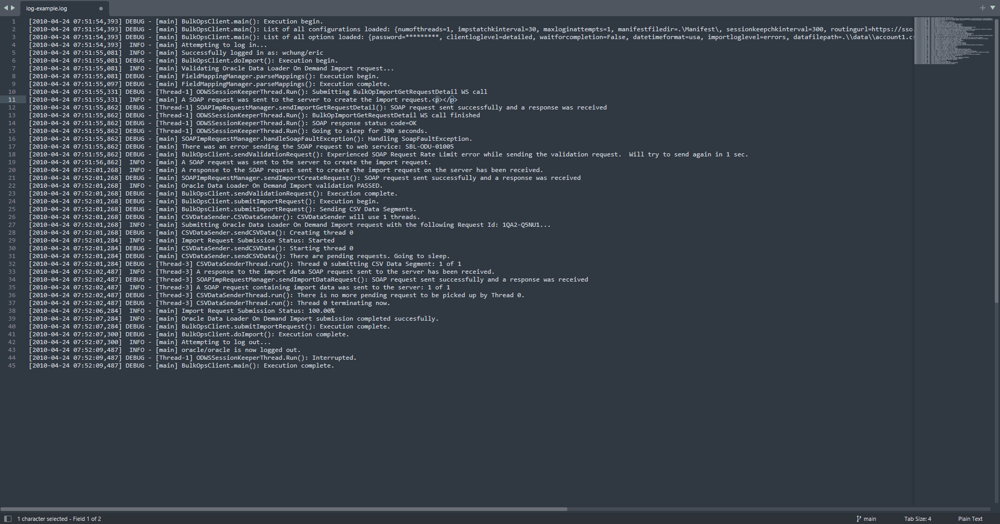

# File Filter Plugin for Sublime Text

## Overview
This plugin allows you to filter file content using regular expressions (RegExp) — **it does not change the file content**.

Matches are highlighted, and text that does not match the RegExp will be folded.

### Features

- File Filtering using RegExp
- Configurable predefined regular expressions
- Supports multiline matching
- Multiple Text Folding Options
  - Adjust how content collapses around matches for better readability
- Customizable Highlighting Styles
  - Highlight matched regions using various styles for better readability

### Installation

1. From the `Command Palette`, run `Package Control: Install Package` command.
2. In the opened packages list, find `FileFilter` package and install it

### File Filter Command

1. From the `Command Palette`, run `File Filter` command
2. Write a RegExp in the prompt (the match may be multiline)
3. The file will be filtered to show only the lines with matches
    - To change the folding style, use the command `File Filter: Folding Style`
    - To change the match areas highlight style, use the command `File Filter: Highlight Style`

#### Regex flags

You can use the `(?aiLmsux-imsx:...)` syntax to add flags.

##### Example:
using `(?:PYTHON)` as regex, filter will match lines with both `python` and `PYTHON`
using `(?:PYTHON)outter` as regex, filter will match lines with both `pythonoutter` and `PYTHONoutter` 

As this is a python plug, you can follow [python regex docs](https://docs.python.org/3/library/re.html#regular-expression-syntax) for detailed information.

### Folding Style Command

Adjust how content collapses around matches for better readability.

1. From the `Command Palette`, run `File Filter: Folding Style` command.

### Highlight Style Command

Adjust how matched text is highlighted.

1. From the `Command Palette`, run `File Filter: Highlight Style` command.

### Quick Panel Command

1. From the `Command Palette`, run `File Filter: Quick Panel` command.
2. A list of quick options will be displayed:
    - `prompt`: same as File Filter command
    - `clear`: clear all filter and highlights - same as exit
    - Additional Predefined RegExp
        - Settings defined options: the remaining of the list can be edited using the `File Filter: Edit Settings` command
        - Add or remove additional predefined RegExp using by editing the `regex_list` property. Each item must be ['description', "regex string"] arrays
3. Choosing an option immediately filters the file.

### Clear Command

Clear all filters.

1. From the `Command Palette`, run `File Filter: Clear` command.

### Edit Settings Command

1. From the `Command Palette`, run `File Filter: Edit Settings` command.
2. Settings files will be shown.

#### Configuration settings file options

- **`default_folding_style`**: Defines the default folding style
  - **Possible Values**:
    - `line`: Fold entire lines.
    - `match_only`: Fold only the matched text.
    - `before_only`: Fold text before the match.
    - `after_only`: Fold text after the match.
    - `highlight_only`: Highlight the matched text without folding.

- **`default_highlight_style`**: Defines the default style for highlighting
  - **Possible Values**:
    - `outline`: Highlight with an outline, no fill.
    - `solid`: Highlight with a solid fill, no outline.
    - `underline_solid`: Highlight with a solid underline, no fill or outline.
    - `underline_stippled`: Highlight with a stippled underline, no fill or outline.
    - `underline_squiggly`: Highlight with a squiggly underline, no fill or outline.
    - `none`: No highlighting.

- **`expression_prompt.refresh_on_change`**: A boolean that determines whether to refresh file filter when prompt changes occur

- **`status_bar`**: Configuration options related to the status bar display.
  - **Properties**:
    - **`show_current_folding_style`**: Boolean indicating if the current folding style should be displayed.
    - **`show_current_highlight_style`**: Boolean indicating if the current highlight style should be displayed.
    - **`show_total_matches`**: Boolean indicating if the total number of matches should be displayed.

- **`on_clear_command_options`**: Configuration options for the clear command behavior.
  - **Properties**:
    - **`unfold_regions`**: Boolean determining whether to unfold regions when the clear command is issued.
    - **`remove_highlights`**: Boolean determining whether to remove highlights when the clear command is issued.
    - **`center_viewport_on_carret`**: Boolean determining whether to center the viewport on the caret when the clear command is issued.

- **`regex_list`**: An array of regex patterns used for matching text. Each entry is an array containing two strings: a label and the corresponding regex pattern.