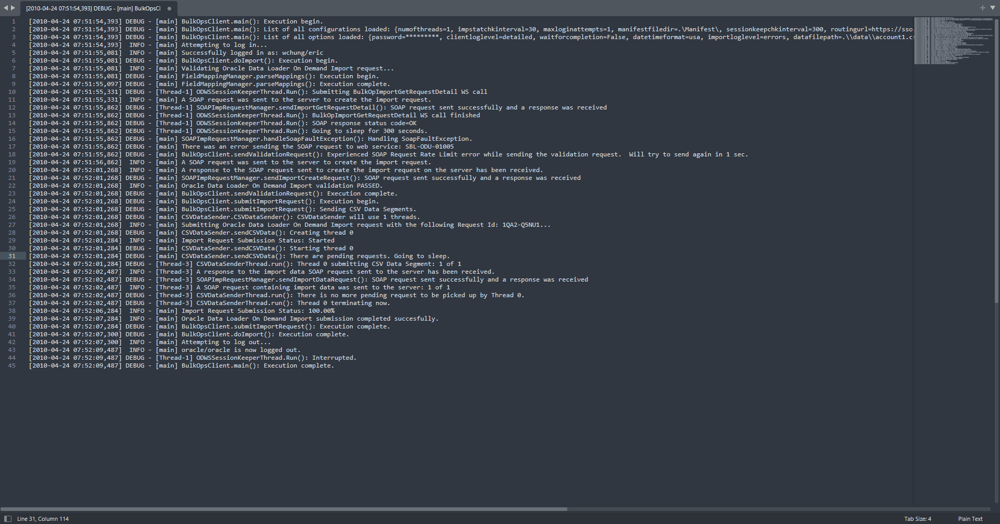
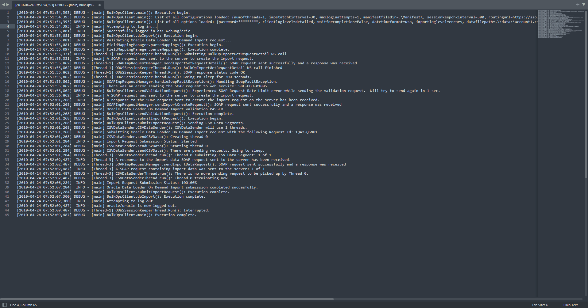

# File Filter Plugin for Sublime Text

## Overview
File Filter highlights regex matches and folds non-matching content without modifying the original file.

It is useful when you want to quickly isolate relevant lines or sections in large log files, source code, or text dumps.

## Features

- Regex-based filtering
- Create filter based on text selection
- Highlight styles for matches
- Folding strategies for non-matching content
- Favorite / preset filters
- History

## Installation

1. Open the Command Palette.
2. Run `Package Control: Install Package`.
3. Search for `File Filter` and install it.

## Regex syntax

For aditional information on valid syntax and options follow [python regex documentation](https://docs.python.org/3/library/re.html) 

#### Flags:

> Flags: use the [`(?aiLmsux-imsx:...)`](https://docs.python.org/3/library/re.html) syntax to add flags.

- using `(?i:PYTHON)` as regex, filter will match lines with both `python` and `PYTHON`

- using `PYTHON` (same as `(?:PYTHON)`) as regex, filter will match lines with `PYTHON`

- using `(?:PYTHON)outter` as regex, filter will `PYTHONoutter` 

## Commands

### File Filter Command

1. Open `Command Palette`, 
2. Select `File Filter` command
3. Select one of the optios
   - New
   - From Selected Text
   - History
   - Favorits
   - Clear

> #### Option: **`New`**

Opens a regex prompt to create a new search pattern.

User settings:

- **`expression_prompt.filter_on_change`**: refreshes the filter while the regex text is being edited.

> #### Option: **`From Selected Text`**

Uses the current selection as the search pattern.

User setting:
- `option_from_selected_text.escape_selection` (`true` / `false`): escapes the selected text before using it as a literal pattern.

> #### Option: **`History`**

Restores a previously used regex from the current view history and applies it immediately.

> #### Option: **`Favorites`**

Applies a saved preset from the `favorits` list to the current view.

User setting:
- **`favorits`**: list of saved named regex presets.

> #### Option: `Clear`

Same as `Clear Command`

User setting:
 - **`option_command_on_clear.unfold_regions`** (`true` / `false`): unfolds hidden regions when clearing.
 - **`option_command_on_clear.remove_highlights`** (**`true`** / **`false`**): removes highlighted matches.
 - **`option_command_on_clear.center_viewport_on_carret`** (**`true`** / **`false`**): recenters the viewport on the caret.

### Set Folding Style Command

Adjust how content collapses around matches for better readability.

1. Open `Command Palette`, 
2. Select `File Filter: Folding Style` command.

User settings:

- **`default_folding_style`**: Defines the default folding style
  - `line`: Fold entire lines.
  - `match_only`: Fold only the matched text.
  - `before_only`: Fold text before the match.
  - `after_only`: Fold text after the match.
  - `highlight_only`: Highlight the matched text without folding.

### Set Highlight Style Command

Adjust how matched text is highlighted.

1. Open `Command Palette`, 
2. Select `File Filter: Highlight Style`

- **`default_highlight_style`**: Defines the default style for highlighting
  - `outline`: Highlight with an outline, no fill.
  - `solid`: Highlight with a solid fill, no outline.
  - `underline_solid`: Highlight with a solid underline, no fill or outline.
  - `underline_stippled`: Highlight with a stippled underline, no fill or outline.
  - `underline_squiggly`: Highlight with a squiggly underline, no fill or outline.
  - `none`: No highlighting.

### Clear Command

Clear all filters.

1. Open `Command Palette`, 
2. Select `File Filter: Clear`

### Edit Settings Command

Opens `user settings` files.

1. Open `Command Palette`, 
2. Select `File Filter: Edit Settings` 

#### Other configuration settings file options

- **`status_bar`**: Configuration options related to the status bar display.
  - **Properties**:
    - **`show_current_folding_style`**: Boolean indicating if the current folding style should be displayed.
    - **`show_current_highlight_style`**: Boolean indicating if the current highlight style should be displayed.
    - **`show_total_matches`**: Boolean indicating if the total number of matches should be displayed.

