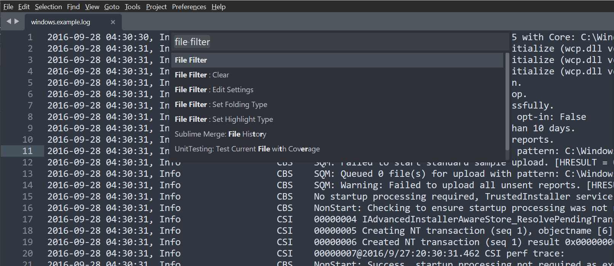
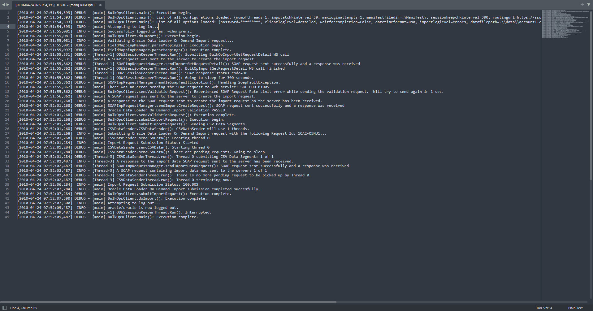
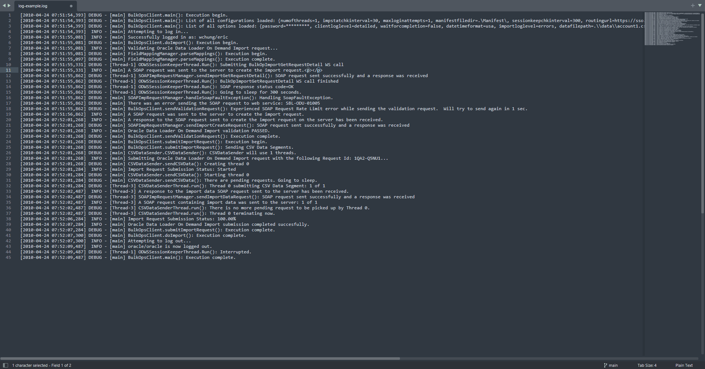

# File Filter Plugin for Sublime Text

## Overview
File Filter highlights regex matches and folds non-matching content without modifying the original file.

It is useful when you want to quickly isolate relevant lines or sections in large log files, source code, or text dumps.



## Features

- Regex-based filtering
- Create filter based on text selection
- Highlight styles for matches
- Folding strategies for non-matching content
- Favorite / preset filters
- History

## Installation

1. Open the Command Palette.
2. Run `Package Control: Install Package`.
3. Search for `File Filter` and install it.


## Commands

### File Filter Command

1. Open `Command Palette`, 
2. Select `File Filter` command
3. Select one of the options:
    - New
    - From Selected Text
    - History
    - Favorites
    - Clear


> #### - Option: **`New`**

Opens a regex prompt to create a new search pattern.


> #### - Option: **`From Selected Text`**

Uses the current selection as the search pattern.


> #### - Option: **`History`**

Restores a previously used regex from the current view history and applies it immediately.


> #### - Option: **`Favorites`**

Applies a saved preset from the `favorits` list to the current view.


> #### - Option: `Clear`

Same as `Clear Command`


### Set Folding Style Command

Adjust how content collapses around matches for better readability.



1. Open `Command Palette`, 
2. Select `File Filter: Folding Style` command.

Options:
  - `line`: Show the entire line, but hide lines with no matches.
  - `match_only`: Show only the matched text.
  - `before_only`: Fold all text before the match. Shows only lines with matches.
  - `after_only`: Fold text after the match. Hides lines with no matches.
  - `highlight_only`: Highlight the matched text without folding or hiding lines.


### Set Highlight Style Command

Adjust how matched text is highlighted.



1. Open `Command Palette`, 
2. Select `File Filter: Highlight Style`

Options:
  - `solid`: Highlight with a solid fill.
  - `outline`: Highlight with an outline, no fill.
  - `underline_solid`: Highlight with a solid underline, no fill or outline.
  - `underline_stippled`: Highlight with a stippled underline, no fill or outline.
  - `underline_squiggly`: Highlight with a squiggly underline, no fill or outline.
  - `none`: No highlighting.


### Clear Command

Clear all filters.

1. Open `Command Palette`, 
2. Select `File Filter: Clear`


### Edit Settings Command

Opens `user settings` files.

1. Open `Command Palette`, 
2. Select `File Filter: Edit Settings` 


## Regex syntax

For additional information on valid syntax and options, follow the [Python regex documentation](https://docs.python.org/3/library/re.html).

#### Flags:

> Flags: use the [`(?aiLmsux-imsx:...)`](https://docs.python.org/3/library/re.html) syntax to add flags.

- Using `PYTHON` (the same as `(?:PYTHON)`), the filter will match lines with `PYTHON`.

- Using `(?i:PYTHON)`, the filter will match lines with `python`, `Python`, `PYTHON`...

- Using `(?:PYTHON)outer`, the filter will match `PYTHONouter`.


## Settings

```json
{
    "global":{
        // minimum log level
        "log_level": 30, 

        // default global regex
        "global_regex_flags": "gi", 
    },
    "defaults":{
        // default highlight settings 
        "highlight":{
            "type": "solid", // 'solid', 'outline', 'underline_solid', 'underline_stippled', 'underline_squiggly', 'none'
        },
        // default folding settings 
        "folding": {
            "type": "line", // 'line', 'match_only', 'before_only', 'after_only', 'highlight_only'
        },
    },  
    "commands":{
        "new":{
            // filter every time the prompt changes
            "filter_on_change": true,
            "show_total_matches": true
        },
        "from_selection":{
            // escape selected text to create the regex 
            "escape_selection": true
        },
        "clear":{
            "center_viewport_on_carret": true,
            "remove_highlights": true,
            "unfold_regions": true
        },
    },
    // list shown in favorits command
    "favorits": [
        {   
            // avoid repeated codes
            "code": "logs-info",
            "name": "logs info",
            "pattern": "\\[INF]",
        },

    ],
}
```